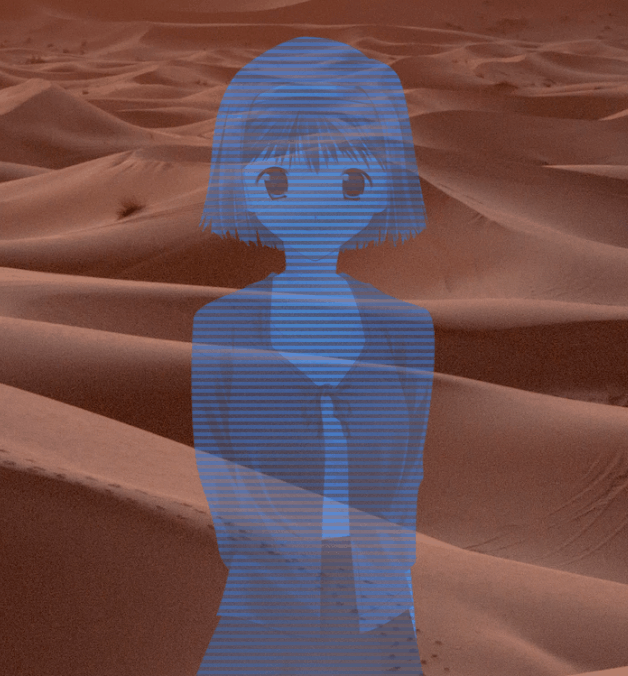

# renpy-SWHolo
A way to display images (or other displayables) with a star wars-styled hologram effect, including tint, transparency, blinking and interlacing effects.

The `holo.rpy` file contains the code itself.

The `script.rpy` file contains an example as to how to use it.

All 6 parameters' default values are defined in the beginning of the file and are editable.
They can all be overriden for each separate instance of the effect.

## Howto
The 6 parameters used to customize the effect on a project-wide basis are stored in the `holovalues` dict at the top of the file.
Its keys are :
- `'tintcolor'` : the color used to tint the hologram. (default is `#06f`, a shade of blue)
- `'totalpha'` : the overall transparency of the hologram. That's the most opaque any pixel of it will be visible. (From 0.0 being invisible to 1.0 being completely opaque, default is .9)
- `'interalpha'` : the relative transparency applied every two lines to create the interlacing effect. It gets multiplied to the overall transparency. (default is .75)
- `'blinking'` : the probability for every single frame to be a "blinking" (more transparent) frame. (From 0.0 being always more transparent to 1.0 being never more transparent, effectively disabling the blinking effect, default is .5)
- `'blinkalpha'` : the relative transparency applied to the "blinking" frames. It gets multiplied with the overall transparency and the interlacing transparency for the affected lines. (From 0.0 being invisible to 1.0 being completely opaque, effectively disabling the blinking effect, default is .9)
- `'lineheight'` : the height of the lines used in the interlacing effect, in pixels. (default is 4)

The main thing you want to use is this :

`Holo(child, tintcolor=holovalues['tintcolor'], totalpha=holovalues['totalpha'], interalpha=holovalues['interalpha'], blinking=holovalues['blinking'], blinkalpha=holovalues['blinkalpha'], lineheight=holovalues['lineheight'])`

- `child` is the displayable (~= image) you want to apply the effect to. You can put a generated displayable (like a `Crop()` or a `Solid()`) or a string giving the name of an image. In the `script.rpy` example it's an implicitly-declared image.
- `tintcolor`, `totalpha`, `interalpha`, `blinking`, `blinkalpha` and `lineheight` are the parameters described above, which can be ignored to use the default system-wide values, or specified to override them.

Then, you can define your hologram as an image to show afterward, using `image hologram = Holo("beautifulcharacter angry")`, or you can also directly show it using `show expression Holo("beautifulcharacter angry") as beautifulcharacter` (I strongly recommand using the `as` clause).

## Terms of use
Use it freely in any project, just drop my name in the credits with a link to this repo 🥰
